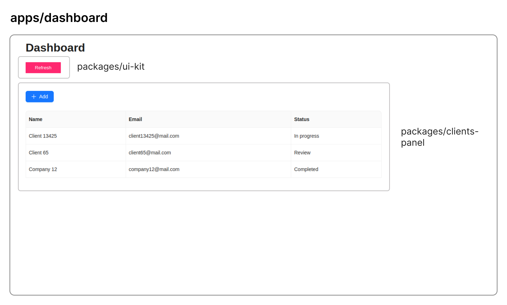

# simple CRM app built with microfrontends

consists of multiple standalone React.js projects:

-   dashboard (`apps/dashboard`): dashboard app, a 'host'/'app' project that represents a
    ready-to-use application

-   clients panel (`packages/clients-panel`): components/code related to clients panel,
    e.g. clients table. this is a 'remote'/'package' project that does not provide a
    ready-to-use interface on its own. uses **ant design** library internally for a table
    component

-   ui kit (`packages/ui-kit`): similarly to clients panel project, provides ui
    components to use in the apps

the projects are loaded in each other during runtime, delivering the
code using http requests

also used **Turborepo** to simplify building and linting multiple projects

